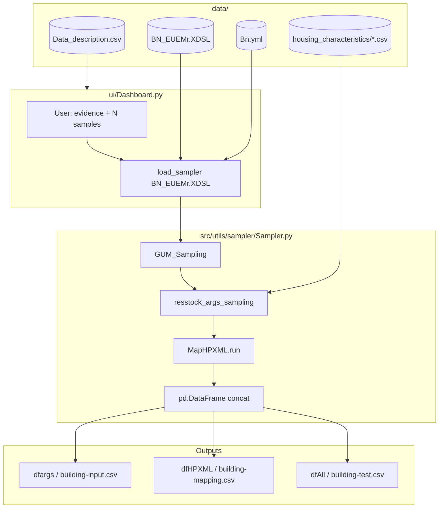

# LTE-Sampler-Residential — Codebase Technical Reference

This document describes how **LTE-Sampler-Residential** is structured and how it operates, based strictly on the current repository. The application generates synthetic residential building samples by combining a **pre-built EUEMr 2022 Bayesian network** (PyAgrum), **conditional ResStock-style housing-characteristic tables** (Pandas), and a **deterministic HPXML argument mapper** (OpenStudio / ResStock measure arguments).

---

## Table of Contents

1. [Repository Architecture & File Map](#1-repository-architecture--file-map)
2. [Logic & Functional Flow](#2-logic--functional-flow)
3. [Input Data & Configuration Mechanics](#3-input-data--configuration-mechanics)
4. [Output Architecture](#4-output-architecture)

---

## 1. Repository Architecture & File Map

### 1.1 Top-Level Layout

```
lte_sampler_code/
├── ui/                          # Streamlit presentation layer
├── src/                         # Core Python package root (uv module-name: "src")
│   ├── main.ipynb               # Notebook reference pipeline
│   └── utils/                   # All business logic (no top-level utils/)
│       ├── sampler/             # Runtime sampling + HPXML mapping
│       ├── euemr/               # BN construction from EUEMr survey (offline)
│       └── hpxml/               # HPXML measure schema + code generation
├── data/                        # Static inputs + runtime outputs
│   ├── processed/               # BN, housing tables, metadata (committed)
│   ├── input/                   # ResStock options lookup (partially committed)
│   ├── hpxml/                   # Source XML for HPXMLArg regeneration
│   └── output/                  # Generated CSVs (git-tracked folder, files optional)
├── documentation/               # pdoc HTML/markdown, presentation assets
├── Dockerfile                   # Container entry: Streamlit dashboard
├── pyproject.toml               # uv project metadata + dependencies
├── requirements.txt             # Locked export from uv
├── README.md                    # Install/run instructions (French)
└── uv.lock
```

**Note on `dataStructure/`:** This repository does **not** contain a `dataStructure/` directory. Structured metadata lives under `data/processed/` (`Data_description.csv`, `Bn.yml`, housing-characteristic CSVs). There is also **no** repository-root `utils/` folder; utilities live under `src/utils/`.

### 1.2 Folder Purposes

| Path | Role |
|------|------|
| **`ui/`** | Streamlit dashboard (`Dashboard.py`). User-facing sampling, BN exploration, export. Docker `CMD` runs this file. |
| **`src/`** | Import root for application code. `main.ipynb` mirrors the production pipeline step-by-step. |
| **`src/utils/sampler/`** | **Runtime core:** `Sampler`, `MapHPXML`, `BuildstockBatchArguments`, PyAgrum BN wrapper. |
| **`src/utils/euemr/`** | **Offline BN builder:** survey formatting, CPT estimation, `EUEMr.Make_BN()`, housing CSV generation. |
| **`src/utils/hpxml/`** | HPXML measure argument dictionary (`HPXMLArg.py`) and XML parser used to regenerate it. |
| **`data/processed/`** | Committed artifacts used at runtime (BN `.XDSL`, `Bn.yml`, housing CSVs, descriptions). |
| **`data/input/`** | Upstream ResStock reference data (`options_lookup.tsv`); most of `data/input/*` is gitignored except `housing_characteristics/`. |
| **`data/hpxml/`** | `measure.xml`, `ResStockArgument.xml` — sources for `HPXMLArg.py` generation. |
| **`data/output/`** | Default destination for notebook/CLI CSV writes; dashboard sidebar can load existing CSVs here. |
| **`documentation/`** | Generated API docs (pdoc), diagrams — not executed at runtime. |

### 1.3 Application Entry Points

Three equivalent ways to run the sampling pipeline:

| Entry | How to launch | Primary use |
|-------|----------------|-------------|
| **Streamlit UI** | `streamlit run ui/Dashboard.py` (see `README.md`, `Dockerfile`) | Interactive constraints, visualization, download |
| **CLI** | `python -m src.utils.sampler.Sampler <bn.xdsl> <N> <out.csv> [-ev '{...}']` | Batch / automation (`Sampler.main()`) |
| **Notebook** | Execute `src/main.ipynb` from `src/` (sets `PROJECT_DIR` to repo root) | Development, D-Tale exploration |

```1098:1116:ui/Dashboard.py
def main():
    """Main application entry point."""
    render_sidebar()
    pages = {
        "Échantillonneur": [
            st.Page(Page_Echantilloneur, title="Échantillonneur", icon="🏠"),
            st.Page(BaysianNetwork, title="Réseau Bayésien", icon="🕸️")
        ]
    }
    pg = st.navigation(pages)
    pg.run()

if __name__ == "__main__":
    main()
```

```207:227:src/utils/sampler/Sampler.py
def main():
    parser = argparse.ArgumentParser(description="Bayesian network sampler for SimParc")
    parser.add_argument("bayesian_network_filepath", type=str, help="Path to the Bayesian network file. (.XDSL)")
    parser.add_argument("samples_number", type=int, help="Number of samples to generate. (Integer)")
    parser.add_argument("output_file",type=str,help="Path for the outputfile (.csv)")
    parser.add_argument('-ev','--evidence',type=json.loads,default={}, nargs='?',help='Evidences passed to the Bayesian network.')
    ...
    results = Sampler(file_path).run_parallel(args.samples_number,ev=args.evidence).to_df()
    results.to_csv(args.output_file, index=False)
```

### 1.4 End-to-End Data Flow (UI → Logic → Files)



**Path resolution:** Both `ui/Dashboard.py` and notebooks resolve the project root as the parent of `ui/` or `src/`:

```41:43:ui/Dashboard.py
FILE_DIR = os.path.dirname(os.path.abspath(__file__))
PROJECT_DIR = os.path.abspath(FILE_DIR + "/../")
sys.path.append(os.path.join(PROJECT_DIR))
```

---

## 2. Logic & Functional Flow

### 2.1 Core Feature: Generating Output Files

The canonical pipeline has **four sequential stages**. Order is identical in the dashboard, notebook, and `Sampler.run_parallel()` / `run_hors_bn()`.

#### Stage 0 — Construct `Sampler`

```25:38:src/utils/sampler/Sampler.py
def __init__(self, bayesian_network_path, **kwargs):
    model = bayesian_network()
    model.Load_BN(bayesian_network_path)
    self.bn_filename = Path(bayesian_network_path).name
    self.bn = model.bn
    self.lst_NOEUD, self.LIST_Dict = model.getBNStructure()
    ...
```

- Loads `gum.BayesNet` from `data/processed/bayesian_network/BN_EUEMr.XDSL`.
- Reads node list and label maps from `data/processed/bayesian_network/Bn.yml` via `bayesian_network.getBNStructure()` (not from the XDSL at runtime).

#### Stage 1 — Bayesian network sampling (`GUM_Sampling`)

**Call chain:**

1. `Sampler.GUM_Sampling(numberOfSamples, evs=Evidence)`
2. `Sampler.draw_GUM_Sample(...)` → `gum.BNDatabaseGenerator(self.bn)`
3. `g.setTopologicalVarOrder()` → `g.drawSamples(number, evs)` → `g.to_pandas()`

```63:102:src/utils/sampler/Sampler.py
def GUM_Sampling(self, numberOfSamples, evs={}):
    dfSampling = pd.DataFrame()
    ...
    dfTemp = self.draw_GUM_Sample(numberOfSamples, 1, evs=evs)
    if len(dfTemp) >= numberOfSamples:
        dfSampling = dfTemp.sample(n=numberOfSamples, random_state=self._seed)
    else:
        # loop until enough rows (evidence can reduce yield)
        ...
    return dfSampling.reset_index(drop=True)
```

**Dashboard invocation:**

```440:441:ui/Dashboard.py
df = InsClsSampler.GUM_Sampling(Nombre_de_Samples, evs=st.session_state.settings)
lst_dct_args = df.to_dict(orient='records')
```

**Output of stage 1:** `list[dict]` with **40 keys** — one per BN node (e.g. `Type_Logement`, `Chauffage_Logement`, `Territoire_HQ`). Values are **human-readable labels** (strings), not internal numeric IDs.

#### Stage 2 — ResStock / housing-characteristic sampling (`resstock_args_sampling`)

**Call chain:**

1. `Sampler.resstock_args_sampling(lst_dct_args)`
2. `BuildstockBatchArguments()` — loads all conditional CSV tables once in `__init__`
3. For each sample dict, for each attribute in `listAttributs` (52 names):
   - Filter `Table` by `Dependency` columns matching merged context (`dctSampler | dct_args2`)
   - Normalize option columns to probabilities
   - `np.random.default_rng.choice(option_keys, p=probs)`
   - Parse `Option=<value>` suffix into attribute value
4. `HConsignes()` adds four heating setback hours

```104:160:src/utils/sampler/Sampler.py
def resstock_args_sampling(self, lst_dct_args={}):
    BBA = BuildstockBatchArguments()
    for dctSampler in lst_dct_args:
        dct_args2 = {}
        for Attributs in BBA.listAttributs:
            dct_dependancy = BBA.dct_housing_characteristics[Attributs]["Dependency"]
            dct_option = BBA.dct_housing_characteristics[Attributs]["Option"]
            df = BBA.dct_housing_characteristics[Attributs]["Table"]
            # filter rows, compute probabilities, sample one option
            ...
        h1, h2, h3, h4 = HConsignes()
        dct_args2["Tconsignes_chauffage_H1"] = h1
        ...
    return lst_dct_args2
```

**Merge rule (dashboard & notebook):**

```448:448:ui/Dashboard.py
lst_dct_args = [d1 | d2 for d1, d2 in zip(lst_dct_args, lst_dct_args2)]
```

BN keys take precedence where names collide (`d1 | d2`: left dict wins on conflict). CLI parallel path uses the opposite order intentionally:

```165:165:src/utils/sampler/Sampler.py
lst_dct_args = [d2 | d1 for d1, d2 in zip(lst_dct_args, lst_dct_args2)]  # lst_dct_args prioritaire
```

*(Comment says BN is priority; Python 3.9+ `|` gives right-hand keys precedence — verify if relying on overlap behavior.)*

#### Stage 3 — HPXML mapping (`MapHPXML.run`)

**Call chain:**

1. `MapHPXML()` → holds `HPXMLArguments()` metadata
2. `MapHPXML.run(lst_dct_args)` loops samples
3. `MapHPXML.doMapping(dct_args)` — ~6,200 lines of conditional rules

```6223:6227:src/utils/sampler/Mapping.py
def run(self, lst_dct_args):
    lst_dct_HPXML = []
    for dct_args in lst_dct_args:
        lst_dct_HPXML.append(self.doMapping(dct_args))
    return lst_dct_HPXML
```

**`doMapping` logic pattern (repeated hundreds of times):**

1. Seed `dct_HPXML` with keys already present in `dct_args` that exist in `HPXMLArg.arguments`.
2. For each rule: if source attribute `arg` in `dct_args`, map through lookup dicts to one or more HPXML parameter names.
3. Apply defaults from `HPXMLArg.arguments[name]["Default Value"]` when defined.
4. Merge empty defaults for missing keys (placeholder dict currently unused).
5. **Exclude** six internal keys (leakage/insulation helpers) before return.

```6208:6221:src/utils/sampler/Mapping.py
k_missing = list(set(self.HPXMLArg.arguments.keys()) - set(dct_HPXML.keys()))
dct_HPXML_missing = {}
dct_HPXML = {**dct_HPXML, **dct_HPXML_missing}
Exclude = ["air_leakage_leakiness_description", "ceiling_insulation_r", ...]
dct_HPXML = {k: v for k, v in dct_HPXML.items() if k not in Exclude}
return dct_HPXML
```

**Observed cardinality:** notebook stdout reports **~205 HPXML keys per sample** after mapping (subset of 522 defined in `HPXMLArg.py`).

#### Stage 4 — Tabular assembly & persistence

```461:463:ui/Dashboard.py
dfargs = pd.DataFrame(lst_dct_args)
dfHPXML = pd.DataFrame(lst_dct_HPXML)
dfAll = pd.concat([dfargs, dfHPXML], axis=1)
```

**Notebook file writes:**

```66049:66051:src/main.ipynb
dfargs.to_csv(PROJECT_DIR+"/data/output/building-input.csv", index=False)
dfHPXML.to_csv(PROJECT_DIR+"/data/output/building-mapping.csv", index=False)
dfAll.to_csv(PROJECT_DIR+"/data/output/building-test.csv", index=False)
```

**CLI parallel path:**

```172:205:src/utils/sampler/Sampler.py
def run_parallel(self, Nombre_de_Samples, **kwargs):
    df = self.GUM_Sampling(Nombre_de_Samples, evs=Evidence)
    ...
    results = Parallel(...)(delayed(self.run_hors_bn)(chunk) ...)
    self.lst_dct_args = list(chain(*[r[0] for r in results]))
    self.lst_dct_HPXML = list(chain(*[r[1] for r in results]))
```

Uses **joblib** `loky` backend with `n_jobs ≈ max((cpu_count - 8), 1)`.

### 2.2 Function Call Order Summary

| Step | Function / Class | File |
|------|------------------|------|
| 1 | `Sampler.__init__` → `bayesian_network.Load_BN` | `Sampler.py`, `bayesian_network.py` |
| 2 | `getBNStructure()` → read `Bn.yml` | `bayesian_network.py` |
| 3 | `GUM_Sampling` → `draw_GUM_Sample` | `Sampler.py` |
| 4 | `BuildstockBatchArguments.__init__` → `csv_to_dict` | `Mapping.py` |
| 5 | `resstock_args_sampling` | `Sampler.py` |
| 6 | `HConsignes` | `utils.py` |
| 7 | `MapHPXML.run` → `doMapping` | `Mapping.py` |
| 8 | `pd.DataFrame`, `pd.concat`, `to_csv` / `st.download_button` | `Sampler.py`, `Dashboard.py`, `main.ipynb` |

### 2.3 Primary Data Manipulation Patterns

#### Pandas DataFrames

| Location | Operation | Purpose |
|----------|-----------|---------|
| `GUM_Sampling` | `concat`, `sample`, `reset_index` | Meet exact sample count under evidence |
| `resstock_args_sampling` | Boolean mask on dependency columns | Row filtering in conditional tables |
| `resstock_args_sampling` | `sum` + normalized `choice` | Categorical draw from `Option=*` columns |
| `EUEMR_bn_generator.Make_BN` | `crosstab`, `MultiIndex`, `apply(normalize)` | Build CPTs from weighted survey (offline) |
| `MapHPXML` | Per-sample `dict` → `DataFrame` | Column-oriented export |

#### In-memory structures

- **`lst_dct_args`:** `list[dict]` — one merged building record per sample (BN + ResStock fields).
- **`lst_dct_HPXML`:** `list[dict]` — OpenStudio HPXML measure argument names → values.
- **`BBA.dct_housing_characteristics`:** nested dict per attribute: `Table`, `Dependency`, `Option`, `Description`, `Source`.

#### Housing table filtering (core algorithm)

```118:135:src/utils/sampler/Sampler.py
filter_dict = {key: {**dctSampler, **dct_args2}[value] for key, value in dct_dependancy.items()}
filtered_index = pd.Series([True] * len(df), index=df.index)
for col, values in filter_dict.items():
    if isinstance(values, list):
        filtered_index = filtered_index & (df[col].isin(values))
    else:
        filtered_index = filtered_index & (df[col] == values)
filtered_df = df[filtered_index]
```

Dependency column headers in CSV use the form `Dependency=<BN_or_prior_attribute_name>`.

### 2.4 Offline / Maintenance Pipelines (Not Runtime)

These modules support **regenerating** artifacts in `data/processed/` but are not called by `Sampler` or `Dashboard` during normal sampling:

| Component | Purpose |
|-----------|---------|
| `EUEMR_bn_generator.EUEMr` | Build BN from `sondage_residentiel_version_finale_formatted.csv`, export CPT CSVs, save XDSL |
| `ParseHPXMLinputs.save_argument_fromfile` | Regenerate `HPXMLArg.py` from `data/hpxml/measure.xml` |
| `Create_housing_characteristics.ipynb` | Excel → semicolon CSVs in `housing_characteristics/` |
| `Data_Description.ipynb` | Build `Data_description.csv`, `EUEMr_description.csv` |

---

## 3. Input Data & Configuration Mechanics

### 3.1 `pyproject.toml` / Python Environment

```1:20:pyproject.toml
[project]
name = "lte-sampler-residential"
requires-python = ">=3.11"
dependencies = [
    "pandas>=2.2.3",
    "pyagrum>=2.1.1",
    "streamlit>=1.47.1",
    "dask[complete]>=2025.5.1",
    ...
]
[tool.uv.build-backend]
module-root = ""
module-name = "src"
```

**Runtime-critical libraries:**

- **pyAgrum** — BN load, inference, `BNDatabaseGenerator` sampling
- **pandas** — CPT tables, housing characteristics, exports
- **numpy** — RNG, CPT reshaping (offline)
- **streamlit** — UI
- **joblib** — CLI parallel sampling
- **PyYAML** — `Bn.yml` structure for UI dropdowns

`pyproject.toml` declares `[project.scripts] test = "scripts.test:main"` but **no `scripts/` package exists** in the repo; tests are not wired.

### 3.2 Bayesian Network Artifacts (`data/processed/bayesian_network/`)

| File | Role |
|------|------|
| **`BN_EUEMr.XDSL`** | **Runtime BN** loaded by `gum.loadBN()` |
| **`Bn.yml`** | YAML tuple: `[lst_NOEUD, LIST_Dict, dict_info]` — 40 nodes, label maps, dependency metadata for UI |
| **`Bn.csv`** | Auxiliary export (not loaded by `Sampler`) |

**`Bn.yml` structure (loaded by `getBNStructure`):**

```161:165:src/utils/sampler/bayesian_network.py
def getBNStructure(self):
    file_path = str(Path(__file__).parents[3] / "data/processed/bayesian_network/Bn.yml")
    with open(file_path, 'r') as file:
        lst_NOEUD, LIST_Dict, dict_info = yaml.safe_load(file)
    return lst_NOEUD, LIST_Dict
```

- **`lst_NOEUD`:** ordered node names (40 EUEMr variables).
- **`LIST_Dict`:** `{node_name: {id: label, ...}}` for Streamlit select boxes.
- **`dict_info`:** human descriptions and graph metadata (used in `Data_description.csv` generation).

**Evidence / constraints:** keys and values must match **labels** in `LIST_Dict`, e.g. `{"Type_Logement": "Maison individuelle"}`. Passed to PyAgrum as `evs` in `drawSamples`.

### 3.3 Housing Characteristics (`data/processed/housing_characteristics/`)

**Format:** semicolon-separated CSV (`sep=";"`).

**Header convention:**

- Dependency columns: `Dependency=<parent_variable>`
- Probability columns: `Option=<value>` (numeric weights, normalized per row)

**Example (`Geometry Stories.csv`):**

```1:3:data/processed/housing_characteristics/Geometry Stories.csv
Dependency=Type_Logement;Dependency=Nombre_Etages;Option=1;Option=2;...
Duplex;Un étage;0.0;1.0;0.0;...
```

**Loader (`BuildstockBatchArguments.csv_to_dict`):**

- Iterates a **fixed catalog** of ~50 CSV filenames in code.
- Skips files not present on disk.
- Produces **53 loaded tables** vs **52** attributes in `listAttributs` (extra file may load without being sampled).

**`listAttributs` (52 sampled attributes)** includes geometry, envelope, HVAC, appliances, setpoints, PV, etc. — see `BuildstockBatchArguments.__init__` in `Mapping.py` lines 6233–6284.

**Dependency sources:** parent names are BN variables (`Type_Logement`, `An_Construction`, …) or previously sampled attributes within the same `listAttributs` loop (`dct_args2`).

### 3.4 Metadata Catalog (`data/processed/Data_description.csv`)

- **97 rows** documenting variables across the full stack.
- Columns: `Nom`, `Description`, `Valeurs`, `Dépendance (parents)`, `Dépendance (enfants)`, `Échantillonneur`, `Source`.
- Breakdown: **40** `Réseau Bayesien`, **52** `BuildstockBatchArguments`, **4** `Code`, **1** hybrid.
- Loaded by dashboard BN explorer: `load_data_description()`.

### 3.5 ResStock Input Reference (`data/input/housing_characteristics/options_lookup.tsv`)

- Large TSV (~14k lines): maps ResStock **Parameter Name** / **Option Name** to measure arguments.
- Used in upstream ResStock tooling and housing-characteristic authoring; **not read directly** by `Sampler.py` at runtime.
- Git: `data/input/*` ignored except `!data/input/housing_characteristics/`.

### 3.6 HPXML Schema Sources (`data/hpxml/`)

| File | Purpose |
|------|---------|
| `measure.xml` | OpenStudio measure arguments — source for `HPXMLArg.py` |
| `ResStockArgument.xml` | ResStock preprocessor measure (reference) |

Regeneration:

```97:98:src/utils/hpxml/ParseHPXMLinputs.py
if __name__ == "__main__":
    save_argument_fromfile(PROJECT_DIR+"/data/hpxml/measure.xml", PROJECT_DIR+"/src/utils/hpxml/HPXMLArg.py")
```

`HPXMLArg.py` defines **522** argument names with metadata (`Type`, `Default Value`, `Choices`, …). `MapHPXML` implements Quebec-specific mapping into a **practical subset** (~205 fields per sample).

### 3.7 EUEMr Survey Data (gitignored path)

`.gitignore` excludes `data/processed/euemr/`. `EUEMR_bn_generator` expects:

`data/processed/euemr/2022/sondage_residentiel_version_finale_formatted.csv`

Weighted by column **`POND1`** (null rows dropped). Used only when **rebuilding** the BN or housing CPT CSVs.

### 3.8 Validation & Reliance Summary

| Check | Behavior |
|-------|----------|
| BN file exists | Failure at `gum.loadBN` if missing |
| Housing CSV missing | Silently omitted from `dct_housing_characteristics` if not in directory listing |
| Zero-probability row | `resstock_args_sampling` raises `Exception("Error in sampling for attribute:" + Attributs)` |
| Dashboard optional validation | `dfAll.isnull().sum()` warning only |
| HPXML keys | No XML schema validation at export — flat CSV of measure arguments |

---

## 4. Output Architecture

### 4.1 Output Channels

| Channel | Format | Producer |
|---------|--------|----------|
| **Streamlit download** | CSV / Excel (3 sheets) / JSON | `Page_Echantilloneur` export tab |
| **Notebook** | CSV files under `data/output/` | `main.ipynb` |
| **CLI** | Single CSV path argument | `Sampler.main()` → `to_csv` |
| **In-memory** | `st.session_state.last_simulation` | Dashboard session |

### 4.2 File Formats & Schemas

#### Combined export (`dfAll`) — primary deliverable

- **Format:** CSV UTF-8, `index=False`, comma separator
- **Shape (reference run):** `N` rows × **~316 columns** (200-sample notebook: 111 intermediate + 205 HPXML)
- **Schema:** horizontal concat of `dfargs` and `dfHPXML` — **no prefix** on column names; name collisions would overwrite at concat time (domains are mostly disjoint)

#### Split exports (notebook convention)

| File | Content | Column domain |
|------|---------|---------------|
| `building-input.csv` | `dfargs` | BN nodes + ResStock sampled attributes + `Tconsignes_chauffage_H1..H4` |
| `building-mapping.csv` | `dfHPXML` | OpenStudio HPXML measure argument names |
| `building-test.csv` | `dfAll` | Full wide table |

#### Excel export (dashboard)

Sheets: `Echantillons`, `HPXML`, `Complet` — same three logical tables.

### 4.3 Output Column Groups (Explicit Design Targets)

#### A. Bayesian network variables (40 columns)

All keys in `lst_NOEUD` / `Sampler.lst_NOEUD`. Examples:

`Territoire_HQ`, `Region_Administrative`, `Type_Logement`, `Type_Batiment`, `Nombre_Etages`, `Nombre_Pieces`, `Superficie_Totale`, `Presence_SousSol`, `Nombre_Personnes`, `Presence_Garage`, `Mode_Occupation`, `An_Construction`, `An_ConstructionCode`, `Climatisation`, `Source_Energie_Chauf`, `Chauffage_Logement`, spa/pool/vehicle/water-heater/appliance nodes, `Eclairage_LED`, etc.

Values: **categorical French labels** matching EUEMr survey bands.

#### B. ResStock / housing-characteristic variables (52 + 4 hours)

From `BuildstockBatchArguments.listAttributs`:

- Geometry: `Geometry Stories`, `Geometry Building Number Units`, `Geometry Building Horizontal Location`, `Geometry Building Level`, `Geometry Foundation Type`, …
- Envelope: `Windows`, `Insulation Wall`, `Insulation Ceiling`, `Insulation Foundation Wall`, `Insulation Floor`, `Insulation Slab`, `Insulation Roof`, `Door Area`, `Door Rvalue`, `Orientation`, `Overhangs`, `Radiant Barrier`, `Roof Material`, `Interior Shading`, …
- HVAC: `HVAC Has Shared System`, `HVAC Heating Efficiency`, `Mechanical Ventilation`, `Heating Setpoint`, `Cooling Setpoint`, `Garage Heating Setpoint`, `Basement Heating Setpoint`, `ModeConsigne`, …
- Appliances / loads: `Usage Level`, `Cooking Range Usage Level`, `Clothes Washer Usage Level`, `Clothes Dryer Usage Level`, refrigerator/freezer/dishwasher fields, `Lighting Usage Level`, `Plug Load`, …
- PV / storage: `Has PV`, `PV Orientation`, `PV System Size`, `Battery`
- Other: `Vacancy Status`, `Dehumidifier`, `Ceiling Fan`, `Spa ChaufType`, ventilation spot hours, …

**Code-generated heating setback hours (float):**

- `Tconsignes_chauffage_H1` … `Tconsignes_chauffage_H4` — decimal hours 0–24 from `HConsignes()` random deviations

#### C. HPXML measure arguments (~205 populated columns per sample)

Names are **snake_case** OpenStudio measure parameters from `HPXMLArg.arguments`. Representative groups produced by `doMapping`:

| Domain | Example output keys |
|--------|---------------------|
| Site / weather | `weather_station_epw_filepath`, `site_time_zone_utc_offset`, `simulation_control_daylight_saving_enabled` |
| Geometry | `geometry_unit_type`, `geometry_building_num_units`, `geometry_unit_orientation`, `geometry_average_ceiling_height`, `geometry_unit_aspect_ratio`, overhang depth fields |
| Envelope | `window_type`, insulation R-values, `air_leakage_value`, foundation/wall/roof constructions |
| HVAC | `heating_system_type`, `heating_system_fuel`, `cooling_system_type`, efficiencies, setpoints |
| DHW | `water_heater_type`, `water_heater_fuel` |
| Appliances | plug loads, refrigerator/freezer ratings, dishwasher, range, clothes washer/dryer |
| PV / battery | `pv_system_max_power_output`, `pv_system_location`, `battery_power`, … |
| Schedules | `schedules_vacancy_period`, unavailable period fields when `Vacancy Status` = Vacant |

**Explicitly excluded from HPXML dict** (even if computed internally):

`air_leakage_leakiness_description`, `ceiling_insulation_r`, `rim_joist_continuous_exterior_r`, `rim_joist_continuous_interior_r`, `rim_joist_assembly_interior_r`, `exterior_finish_r`

#### D. Types

| Source | Typical dtypes in CSV |
|--------|------------------------|
| BN / ResStock labels | string (object) |
| `Geometry Stories`, `Geometry Building Number Units` | int (when parsed from `Option=`) |
| `Tconsignes_chauffage_H*` | float |
| HPXML fields | mixed: bool, int, float, string per measure spec |

### 4.4 File Writing Implementation

```197:205:src/utils/sampler/Sampler.py
def to_df(self):
    dfargs = pd.DataFrame(self.lst_dct_args)
    dfHPXML = pd.DataFrame(self.lst_dct_HPXML)
    dfAll = pd.concat([dfargs, dfHPXML], axis=1)
    return dfAll

def to_csv(self, output_path):
    dfAll = self.to_df()
    dfAll.to_csv(output_path, index=False)
```

**Dashboard download** uses in-memory `dfAll.to_csv().encode('utf-8')` with timestamped filename `resultats_YYYYMMDD_HHMMSS.csv`.

**No other binary output formats** (HPXML XML, OSM, etc.) are generated in this repository — output is **tabular measure arguments** intended for downstream OpenStudio / ResStock workflows.

### 4.5 Downstream Consumption Model

The generated CSV is a **batch of ResStock/OpenStudio HPXML preprocessor arguments**:

1. Each row = one synthetic Québec residential unit.
2. `building-mapping.csv` columns align with `HPXMLArg` / `measure.xml` argument names.
3. `building-input.csv` retains human-readable BN + intermediate fields for QA, calibration, and BN posterior comparison (dashboard “Comparaison BN vs Échantillon”).

---

## Appendix A — Module Dependency Graph

```
ui/Dashboard.py
    └── src.utils.sampler.Sampler
            ├── src.utils.sampler.bayesian_network  → Bn.yml, BN_EUEMr.XDSL
            ├── src.utils.sampler.utils             → HConsignes, chunks
            └── src.utils.sampler.Mapping
                    ├── BuildstockBatchArguments    → data/processed/housing_characteristics/*.csv
                    └── MapHPXML
                            └── src.utils.hpxml.HPXMLArg  → HPXMLArg.py (522 defs)

src/utils/euemr/EUEMR_bn_generator.py  (offline)
    ├── EUEMR_attributs.py
    ├── euemr/Mapping.py
    └── bayesian_network.py
```

---

## Appendix B — Quick Reference Commands

```bash
# UI (local)
streamlit run ui/Dashboard.py

# CLI batch (parallel ResStock + HPXML per chunk)
python -m src.utils.sampler.Sampler \
  data/processed/bayesian_network/BN_EUEMr.XDSL \
  1000 \
  data/output/samples.csv \
  -ev '{"Type_Logement": "Maison individuelle"}'

# Docker
docker build -t lte-sampler .
docker run -p 8501:8501 lte-sampler
```

---

*Document generated from repository analysis. For variable-level lineage, use `data/processed/Data_description.csv` as the authoritative crosswalk between BN nodes, housing parameters, and HPXML targets.*
