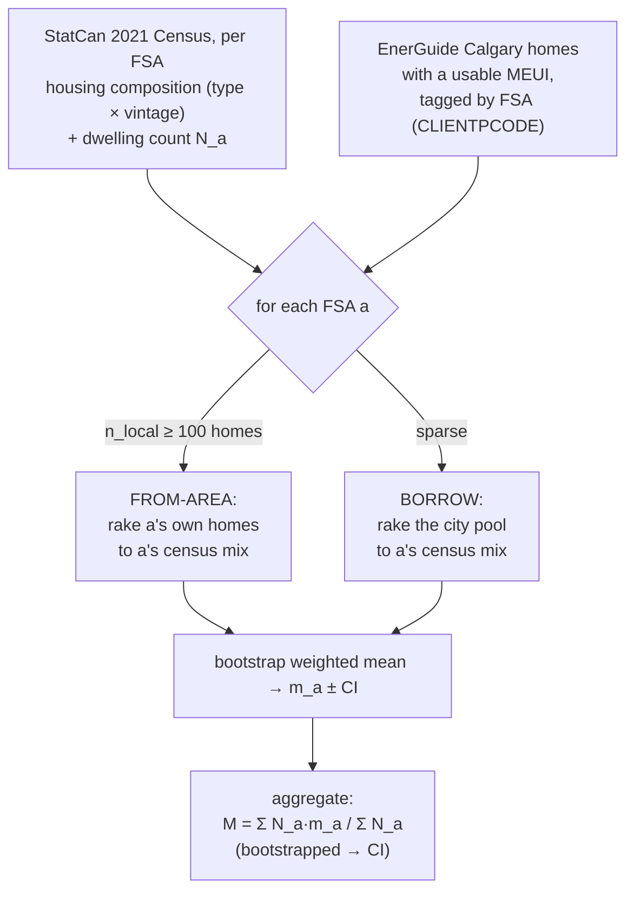

# Area-based Calgary Energy-Use Profile — Methodology

*Technical companion to `calgary_adaptation/energy_profile.py`.
The spatial refinement of the city-wide method in `ENERGY_PROFILE_METHODOLOGY.md`.*

---

## 1. The question

The city-wide build answers *"what is Calgary's average energy-use intensity?"* with one
number over one city composition. This build answers the **spatial** version:

> *For each census area, use its own housing mix to estimate its energy use, then aggregate
> the areas — weighted by how many dwellings each holds — into a city total.*

It produces a **map** (a per-FSA profile) and a **population-weighted aggregate** that
reflects the real spatial distribution of the stock, rather than assuming every neighbourhood
looks like the city average.

## 2. The procedure in one picture



## 3. The recipe, in words

This is the user's "100 buildings" recipe applied **per area and then summed**:

1. **Pick a census area.** The finest geography available is the **forward sortation area
   (FSA)** — the first three characters of the postal code (e.g. `T3M`). EnerGuide stores
   exactly this in `CLIENTPCODE` (100% coverage), so every home already carries its FSA.
2. **Find its housing composition.** From StatCan **98-401-X2021013** (2021 Census Profile
   by FSA) we take each FSA's dwelling mix — structural type folded to the four
   census-backed BN types, and period of construction in the census's own eight bins — plus
   its **dwelling count `N_a`** (the aggregation weight).
3. **Draw matching homes and average.** IPF-rake a pool of EnerGuide homes to that FSA's
   type × vintage composition, then bootstrap the weighted mean MEUI → the area estimate
   `m_a` with a 95% CI. ("Draw N_a homes matching the composition, average" and "reweight the
   pool to the composition, average" are the same estimator; the reweight covers both
   dimensions at once and needs no manual quota.)
4. **Aggregate.** The city mean is the population-weighted average of the area means,
   `M = Σ N_a·m_a / Σ N_a`, with its CI from synchronized bootstrap replicates.

### "Calgary" = which FSAs

EnerGuide's `CLIENTCITY = "Calgary"` is loose — a few records carry FSAs from Edmonton
(`T6W`), Airdrie (`T4B`) or rural Alberta (`T0M`). Those must not pull non-Calgary census
dwelling counts into the aggregate, so the area unit is defined as **FSA prefix `T2`/`T3`
plus `T1Y`** (NE Calgary): 36 FSAs, 507,840 dwellings ≈ 96.5% of Calgary's ~526k occupied
private dwellings, with no out-of-city contamination.

## 4. The hybrid draw, and the load-bearing assumption

Per-area EnerGuide support is uneven: of the 36 FSAs, 34 have ≥ 100 MEUI homes but a few
(downtown `T2P`, `T2R`) have only a handful. So the draw source is **hybrid**:

- **From-area** (`n_local ≥ MIN_AREA_SUPPORT = 100`): rake the FSA's *own* homes to its census
  composition. This lets a neighbourhood's real homes — not just its type/vintage mix — speak,
  capturing effects (built form, retrofit history, occupant behaviour) that composition alone
  misses.
- **Borrow** (sparser FSAs): rake the *whole Calgary pool* to the FSA's composition.

> **Assumption.** *Borrow* mode assumes **energy ⊥ location | composition** — that once you
> know a home's type and vintage, its neighbourhood adds nothing. *From-area* mode **relaxes**
> that assumption wherever the data are thick enough to support it. Reporting the aggregate
> both ways (below) measures how much that relaxation matters.

Metric, bootstrap mechanics, and the "randomly distributed within a cell" assumption are
inherited unchanged from the city-wide method (see `ENERGY_PROFILE_METHODOLOGY.md §4–5`):
MEUI (kWh/m²·yr, size-normalized), and each FSA's CI comes from resampling its homes and
recomputing the weighted mean, so **CI width tracks the effective sample size `n_eff`**.

## 5. Results

`data/output/calgary_fsa_energy_profile.csv`, seed 20260721, K = 5000. 34 FSAs estimated
from-area, 2 borrowed.

**Aggregate Calgary mean MEUI**

| Method | mean | 95% CI |
|---|---:|---|
| Hybrid (from-area where supported) | **143.6** | 140.3 – 146.8 |
| Borrow-only (pure composition-matching) | 144.9 | 143.3 – 146.4 |

- The **borrow-only** aggregate (144.9) reproduces the city-wide estimate (146.3 kWh/m²·yr)
  up to the area method's deliberate differences (type × vintage only, no tenure; the census's
  8 vintage bins; 96.5% FSA coverage) — the expected consistency check.
- The **neighbourhood signal** — hybrid minus borrow-only — is **−1.3 kWh/m²·yr**: letting
  real neighbourhood homes speak nudges the city average down slightly. Small in the aggregate,
  because composition already explains most of the variation (below), but not zero.

**The spatial gradient is the headline.** Per-FSA mean MEUI spans **97 → 202 kWh/m²·yr**, and
it is strongly explained by neighbourhood age (correlation of per-FSA MEUI with the share of
dwellings built before 1980 = **0.73**):

| | FSA | mean MEUI | 95% CI | pre-1980 share |
|---|---|---:|---|---:|
| Lowest | `T3N` (far NW, new) | 97.3 | 89.9 – 103.0 | 1% |
| | `T3R` | 97.9 | 90.3 – 105.4 | 3% |
| | `T3P` | 100.5 | 98.3 – 102.7 | 1% |
| Highest | `T2E` (inner NE, old) | 201.6 | 145.4 – 249.4 | 57% |
| | `T3S` | 177.5 | 128.8 – 215.9 | 35% |
| | `T2S` | 175.4 | 127.4 – 214.8 | 54% |

New-suburb FSAs use roughly **half** the intensity of the oldest inner-city FSAs —
consistent with the city-wide vintage gradient (81 → 215 kWh/m²·yr across construction bins).

Figures: `figures/22_fsa_meui_ranked.png` (all FSAs ranked, CI whiskers, coloured by
from-area vs borrow), `figures/23_fsa_meui_vs_vintage.png` (the MEUI-vs-vintage gradient).

## 6. Known limitations

- **A true choropleth map is not produced** (no geopandas / FSA boundary file in the repo);
  the ranked bar chart and the vintage scatter stand in. A map is a future add via StatCan's
  `lfsa000b21s` cartographic boundaries.
- **Thin FSAs have wide, sometimes skewed CIs** (`T2E`, `T2S`, `T2V`), and the 2 borrowed
  downtown FSAs rest entirely on the composition-independence assumption.
- **Composition folding is coarse by necessity:** the FSA census cannot populate the finer
  decade bins, so 8 census vintage bins are used and BN Triplex folds into Collective; tenure
  is dropped from the per-FSA raking (it was imputed, not observed).
- Everything inherits the city-wide method's **44% MEUI coverage** and its within-cell
  self-selection caveat.

## 7. Reproducing

```
python calgary_adaptation/fetch_data.py --only census   # one-time: fetch FSA composition
python calgary_adaptation/energy_profile.py
```

Deterministic given the fixed seed. Config (`energy_profile.py` top):
`MIN_AREA_SUPPORT` (the from-area/borrow threshold), `SEED`; bootstrap depth and metric are
shared with `energy_profile.py`.
