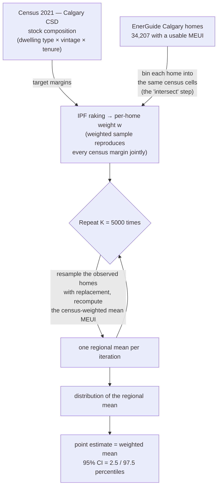

# Calgary Energy-Use Profile — Methodology

*Technical companion to `calgary_adaptation/energy_profile.py`.
Builds on the census weighting documented in `PHASE2B_METHODOLOGY.md`.*

---

## 1. The question

*What is the average household energy-use intensity of Calgary's housing stock,
and how well do we actually know it?*

We answer it with the EnerGuide homes as our measurements and the 2021 census as
the description of the stock we want them to represent. The second half of the
question — the uncertainty — is why we resample rather than report a single
number.

## 2. The procedure in one picture



## 3. The recipe, in words

The plan is the "100 buildings" recipe made statistically honest:

> *For a region of N buildings, the census says (say) 55 are single-detached, 27
> are apartments, and so on. Draw that many homes from the matching EnerGuide
> pool, average their energy use, and repeat many times. The spread of those
> averages is your uncertainty.*

Three refinements turn that into the implemented method:

1. **The census composition is multi-dimensional.** The census constrains
   dwelling *type* **and** construction *vintage* **and** *tenure* at the same
   time, and it gives each as a separate marginal (not a full joint table). A
   per-type quota ("55 single-detached") matches only one dimension. Iterative
   Proportional Fitting (IPF, reused from `calibrate_stock.py`) instead
   assigns every home a weight `w` so that the *weighted* sample reproduces
   **all three** margins simultaneously. Drawing homes in proportion to `w` is
   then the multi-dimensional generalization of the quota — it reproduces the
   census composition across every dimension at once.

2. **"Intersect" = binning homes into census cells.** Each EnerGuide home is
   mapped to its census cell (`Type_Logement`, `An_Construction`,
   `Mode_Occupation`); the weight corrects for cells the administrative sample
   over- or under-recruited (grant applicants skew to detached owners; apartments
   and renters are badly under-sampled — see `PHASE2B_METHODOLOGY.md §1`).

3. **The resampling gives the uncertainty, not the point estimate.** The point
   estimate is just the weighted mean. What repetition buys us is the *sampling
   distribution* of that mean — how much it would move if we had drawn a
   different but equally-plausible set of homes — which the single weighted mean
   cannot express.

## 4. The load-bearing assumption

> **Within each census cell, the EnerGuide homes are treated as a random,
> representative sample of that cell's true population.**

This is the "assume the Quebec survey is randomly distributed" assumption carried
over from the Hydro-Québec pipeline (`src/utils/euemr/Mapping.py::Create_Pond`).
It says a home's only job is its cell membership: once we condition on the cell,
which specific homes we observed is as-good-as-random. The weight repairs *cross*-
cell imbalance; this assumption asserts there is no residual *within*-cell bias to
repair. It is an assumption, not a fact — grant applicants within a cell may still
differ from non-applicants (e.g. worse-performing homes seek retrofit grants) —
and it is the main threat to validity of the point estimate.

## 5. Why MEUI, and why resample the homes rather than the draws

**Metric — MEUI (Modelled Energy Use Intensity, kWh/m²·yr).** It is normalized by
floor area, so it compares homes of different sizes fairly and, critically, is not
distorted by building count: EnerGuide's whole-building total (`EGHFCONTOTAL`)
counts an entire apartment block as one record, so weighting the stock toward
apartments (27% of Calgary) *doubled* the total-energy mean purely as an artefact.
MEUI sidesteps that. The cost is coverage — MEUI exists on 44% of Calgary homes
(ERS v11+ evaluations, ~2019 onward), so the profile describes the more recently
evaluated stock.

**Bootstrap design.** Each iteration resamples the *observed homes* uniformly with
replacement and recomputes the census-weighted mean `Σwy / Σw`. This is the
textbook bootstrap for the standard error of a weighted mean, and it makes the
interval honest under weight concentration: where a cell's weight sits on a few
homes (small Kish *n*ₑ𝒻𝒻), whether those homes land in a given resample swings the
weighted mean, so the interval widens. The naive alternative — drawing *N* homes
∝ weight and taking a plain mean — produces an interval that collapses toward zero
as *N* grows, reporting false precision (±0.6 kWh/m²·yr when the effective sample
is only 161 homes). We report the effective sample size *n*ₑ𝒻𝒻 alongside every
interval so the thin-support cells are visible, not hidden.

## 6. Results

Calgary regional average, and the profile broken out by dwelling type and
construction vintage (`data/output/calgary_energy_profile.csv`, seed 20260720,
K = 5000). Interval width tracks *n*ₑ𝒻𝒻 — the honest signature of a resampling
estimate.

**All Calgary: 146.3 kWh/m²·yr (95% CI 138.1 – 156.1),** n = 34,207, *n*ₑ𝒻𝒻 = 161.

### By dwelling type

| Dwelling type | n | *n*ₑ𝒻𝒻 | mean MEUI | 95% CI |
|---|---:|---:|---:|---|
| Maison individuelle (single-detached) | 28,972 | 19,804 | 145.1 | 144.3 – 145.8 |
| Maison en rangée (row) | 2,590 | 1,416 | 150.2 | 147.1 – 153.4 |
| Duplex | 2,610 | 953 | 146.4 | 142.9 – 150.0 |
| Collective (apartment) | 17 | 12 | 146.1 | 114.1 – 181.7 |
| Triplex | 18 | 5 | 218.5 | 162.2 – 266.6 |

### By construction vintage

| Vintage | n | *n*ₑ𝒻𝒻 | mean MEUI | 95% CI |
|---|---:|---:|---:|---|
| < 1950 | 603 | 201 | 215.4 | 206.7 – 224.2 |
| [1950 – 1960) | 1,328 | 4 | 228.4 | 164.8 – 258.1 |
| [1960 – 1970) | 1,845 | 1,532 | 156.6 | 154.3 – 159.1 |
| [1970 – 1980) | 3,795 | 20 | 166.6 | 154.0 – 180.2 |
| [1980 – 1990) | 3,847 | 27 | 163.4 | 156.5 – 170.4 |
| [1990 – 2000) | 5,941 | 4,907 | 139.4 | 138.4 – 140.5 |
| [2000 – 2010) | 5,086 | 24 | 133.5 | 128.6 – 140.4 |
| [2010 – 2020) | 3,087 | 13 | 96.8 | 86.9 – 106.5 |
| ≥ 2020 | 8,675 | 7 | 80.8 | 50.9 – 106.5 |

The vintage gradient is the headline physical result: post-2020 homes use roughly
a third of the intensity of pre-1950 homes (81 vs 215 kWh/m²·yr), consistent with
successive building-code tightening.

Figures: `figures/19_meui_bootstrap_distribution.png` (the sampling distribution
above), `figures/20_meui_by_dwelling_type.png`, `figures/21_meui_by_vintage.png`.

## 7. Known limitations

- **Thin apartment/old-vintage support.** Calgary has only 17 `Collective`, 18
  `Triplex`, and (post-MEUI-filter) very few 1950s homes with driving weight, so
  those intervals are wide and their point estimates fragile. The `[1950 – 1960)`
  cell (*n*ₑ𝒻𝒻 = 4) has a visibly skewed bootstrap — the script flags it. Pooling
  the all-Alberta stock (reweighted to Calgary) would borrow support here; it was
  deferred by choice to keep the pool literally "homes in the region."
- **Coverage bias.** The 44% of Calgary homes carrying MEUI are the more recently
  evaluated ones; the profile leans toward that stock.
- **Within-cell self-selection** (§4) is unverified and is the main caveat on the
  point estimates.

## 8. Reproducing

```
python calgary_adaptation/energy_profile.py
```

Deterministic given the fixed seed. Config knobs (`energy_profile.py` top):
`REGION_CITY`, `METRIC`, `N_BOOTSTRAP`, `SEED`, `SAMPLE_SIZE` (set the last to a
small number, e.g. 100, to model the variability of a small region rather than the
estimation uncertainty of the full sample).
