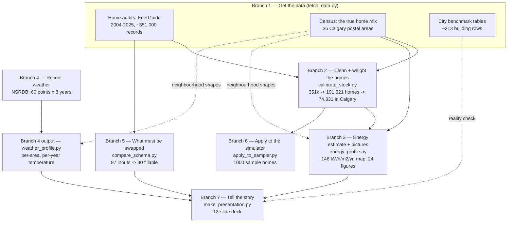

# How this folder works — the runtime, in plain language

This folder re-points a Québec home-energy tool at **Calgary**. It takes public data,
cleans and corrects it, and produces: a trustworthy **Calgary home energy-use number** (with
an honest error range), a **neighbourhood map**, a **recent weather profile**, a **checklist of
what the simulator still needs**, and a **slide deck** that tells the story.

Think of it as a few independent **branches**. Each branch starts from one data source, does
one job, and produces one thing. The branches then **join** to form the final outputs. Below,
each branch says *what it does*, *how much data it handles*, *what it produces*, *why we need
it*, and *why it isn't just repeating another branch*.

> **A few words explained once (no jargon assumed):**
> - **Home audit (EnerGuide):** an official energy inspection of a house.
> - **Census:** the government count of how many homes of each kind exist.
> - **Postal area (FSA):** the first three characters of a postal code, e.g. `T2E` — our
>   "neighbourhood" unit. Calgary has 36 of them.
> - **Re-weighting (raking):** counting some homes as "worth more" and others "worth less"
>   so a lop-sided sample matches the real city.
> - **Confidence range (bootstrap):** re-doing the calculation thousands of times on
>   reshuffled data to see how much the answer wobbles — that wobble is the error range.
> - **Energy-use intensity:** energy used per square metre per year, so a condo and a
>   mansion can be compared fairly.
> - **Degree-days:** a simple "how cold was the year" number (bigger = more heating needed).

---

## The branches at a glance



---

## Branch 1 — Get the data · `fetch_data.py`

- **What it does:** downloads the three raw ingredients and records where each came from.
- **How much:** **~351,000** home-audit records (EnerGuide, 2004–2025, arriving as **20**
  yearly files); the **census** home-mix for Calgary's **36** postal areas (about **507,840**
  dwellings); and city benchmark tables (**~201** existing + **12** new building rows).
- **Produces:** raw files under `data/input/alberta/…` plus a `SOURCES.md` provenance log.
- **Why we need it:** nothing downstream exists without raw inputs.
- **Not redundant because:** it is the only branch that touches the outside world; every other
  branch reads these cached files and never re-downloads.

## Branch 2 — Clean + weight the homes · `calibrate_stock.py`

- **What it does:** turns the messy audit pile into one clean, *representative* table of homes.
  Two steps — `combine` (de-duplicate) then `weights` (label + re-weight).
- **How much:** **351,000** audit records → **191,621** unique homes → **74,331** of them in
  Calgary. Each home is then re-weighted so the sample's mix (house type × age × own/rent)
  matches the census.
- **Produces:** `alberta_stock_mapped.parquet` (every home with a weight).
- **Why we need it:** the raw audits are a *lop-sided* sample — too many detached houses and
  brand-new builds, almost no apartments. Weighting fixes that.
- **Not redundant because:** the audits know *energy* but not *representativeness*; the census
  knows *representativeness* but has *no energy*. This branch is the only place the two meet.

## Branch 3 — Energy estimate + pictures · `energy_profile.py`

- **What it does:** computes Calgary's average home energy-use intensity with an error range,
  breaks it down by neighbourhood, draws the map, and makes explainer charts. One command with
  four parts: `city`, `area`, `map`, `describe`.
- **How much:** of the 74,331 Calgary homes, **34,207** carry a measured energy-intensity
  number. From those: **146 kWh per m²·year (range 138–156)** citywide; a **36-neighbourhood**
  breakdown (city aggregate **143.6**); a colour map; and **24** figures total.
- **Produces:** `calgary_energy_profile.csv`, `calgary_fsa_energy_profile.csv`, `figures/01–24`.
- **Why we need it:** this is the headline deliverable — the actual Calgary energy number and
  the neighbourhood picture.
- **Not redundant because:** it is the only branch that produces energy *results*; the parts
  differ (`city` = one number, `area` = per-neighbourhood, `map` = the picture, `describe` =
  raw-data profiling), and they share code rather than repeat it.

## Branch 4 — Recent local weather · `weather_profile.py`

- **What it does:** reads recent local weather and summarizes it by neighbourhood and year.
- **How much:** **480** weather files = **60** grid points across Calgary × **8** years
  (2018–2025) of hourly temperature → a **36 neighbourhoods × 8 years** table of average
  temperature and heating/cooling degree-days.
- **Produces:** `calgary_fsa_weather_profile.csv`.
- **Why we need it:** energy use depends on the weather, and this is *recent, real* weather —
  unlike the single, older "typical year" the simulator ships with.
- **Not redundant because:** neither the audits nor the census contain any weather. (Honest
  limit: this data is temperature-only, so it can't yet feed the full physics simulator.)

## Branch 5 — What must be swapped for Calgary · `compare_schema.py`

- **What it does:** goes through every input the simulator expects and marks whether the
  Calgary audits can supply it.
- **How much:** all **97** simulator inputs → **30** can be filled directly from the audits,
  **3** estimated from census, **22** kept from Québec (no Alberta data), **35** generic
  engineering defaults, the rest already set.
- **Produces:** `energuide_vs_quebec_crosswalk.csv`.
- **Why we need it:** it turns the vague goal "make it Calgary" into a concrete to-do list.
- **Not redundant because:** it is the only branch that compares the *simulator's needs*
  against the *available data* — an audit of coverage, not a data product.

## Branch 5b — Work out the Calgary odds · `derive_targets.py`

- **What it does:** reads the heating odds out of the audit data instead of anyone typing them
  in. Answers two questions — *which fuel* and *which equipment* — separately for each kind and
  age of home, because that is how the simulator asks them. Then works out **what kind of city
  those odds get applied to**: the mix of house types, ages, tenure, storeys and floor areas.
- **How much:** **73,927** weighted Calgary homes → **15** fuel cells (building type × age),
  **25** equipment cells (home type × fuel), **5** stock tables and **5** end-use tables.
- **Produces:** `data/output/calgary_bn_targets.json`, every cell tagged with how many audited
  homes stand behind it.
- **Why we need it:** hand-typed numbers are one number for the whole city. The data knows an
  apartment (60% hot-water heating) from a detached house (97% forced-air furnace). And a
  correct per-house-type odds table is still wrong overall if the simulator builds the wrong
  city out of it — which it did: 55% detached where Calgary has 64%.
- **Where the housing mix comes from:** the **2021 census**. Branch 2 rakes the whole *Alberta*
  pile to *Calgary* census margins, so taking the Calgary rows out afterwards used to land on a
  subset that matched neither (34% apartments against the census's 27%) — and every conditional
  below it, heating included, inherited that error. Branch 5b now **re-weights the Calgary homes
  against the Calgary census itself** before reading any odds off them; the weighted mix matches
  the census to eight decimal places. The mix is still read straight off the census, because that
  figure is exact while a re-weighted one is only fitted to it.
- **The end uses, straight from the audits:** cooling (`AIRCONDTYPE`), water-heater fuel
  (`PDHWFUEL` crossed with the heating fuel, so the two stay correlated), water-heater size
  (`PDHWTYPE` for tankless, `PRIMARYDHWTANKVOLUME` for the rest), basements
  (`BASEMENTFLOORAR` / `CRAWLSPFLOORAR`) and airtightness (`AIR50P`). These are things an
  auditor measured inside Calgary homes, so unlike the housing mix above they carry no
  census-margin caveat. They were also the largest remaining errors: the network had **29.5%**
  of Calgary without air conditioning against a measured **83.9%**, ran **31.2%** of water
  heating on electricity against a measured **6.9%**, and left **57%** of homes without the
  basement that **87%** of Calgary has.
- **Four limits on the end uses.** `ChaufEau_Presence` is *not* derived — the audits have no
  field separating a dwelling's own water heater from a building-central one, and the only cell
  where that matters (apartments) is exactly the one they cannot identify, so it keeps its
  Québec values. The 6-foot threshold in the basement labels is not observable, so any
  basement maps to the full-height state. Tank volume is missing for **43.5%** of homes, so the
  sizes rest on the 56.5% that report one. And cooling is broadcast across heating systems
  rather than jointly derived, because the audits do not describe heating equipment at the
  resolution the network conditions on — heat-pump homes keep their Québec cooling rows,
  since there the heating equipment *is* the air conditioner.
- **What the re-weighting costs in precision.** Raking 73,927 Calgary audits onto the census mix
  needs large weights, because the audited pile is 83% detached and 0.2% apartments where the city
  is 55% and 27%. The Kish *effective* sample size is **974 homes**, 1.3% of the nominal count —
  41,118 of it behind detached houses but only **73** behind apartments. Every "73,927 audited
  homes" figure should be read with that in mind: it is the number of records, not the amount of
  independent evidence. The raking step prints both on every run.
- **Honest limit, printed on every run:** apartments are ~27% of Calgary but only **121** were
  ever audited. Weighting fixes *how many* apartments there are, not *which ones* got audited, so
  the gas share (98%) is biased high — Alberta-wide figures suggest 93–96%.
- **Second honest limit:** floor area is recorded per-*building* for some apartment records and
  per-*dwelling* for others. The 29 whole-building records are dropped; left in, they rode 27%
  of the city's weight and claimed 6.7% of Calgary homes are over 5,000 ft² (the true figure is
  near 1%).

## Branch 6 — Apply to the simulator · `apply_to_sampler.py`

- **What it does:** rewrites the Calgary odds into the simulator, generates sample homes,
  checks them and writes the paperwork. Seven parts: `targets`, `bn`, `cpt`, `coverage`,
  `batch`, `validate`, `docs`.
- **How much:** rewrites **13 of the 41** variables in the network — heating fuel, heating
  equipment, dwelling type, vintage, tenure, storeys, floor area, household size, cooling,
  water-heater fuel and size, basements and airtightness — plus **5 of the 53**
  housing-characteristics tables, then generates **1,000** sample homes
  (~**205** simulator inputs each) in about 12 seconds.
- **What is still Québec:** the other 24 — pools and spas (**11** of them), appliances and
  lighting, room count (the audits record none), garages, EVs, and whether a water heater
  serves one unit or a building. The `bn` step derives this list from the network itself and
  prints it on every run, so it cannot go stale. Pools are the conspicuous one: the network
  still says roughly **19%** of Calgary dwellings have a pool, which is Québec's rate, and
  `validate` prints a warning saying so on every run. Nothing in the repo sources a Calgary
  figure, and an invented one would be worse than a labelled Québec one.
- **Two nodes are deliberately left alone:** `Type_Batiment` and `An_ConstructionCode` are
  deterministic collapses of `Type_Logement` and `An_Construction` — they inherit the Calgary
  mix on their own, and overwriting them would break the identity the fuel odds are keyed on.
- **The detail tables are all still Québec — and that is now the honest state.** `cpt` used to
  rewrite one of the 54 `housing_characteristics` tables (`HVAC Heating Efficiency.csv`) by
  boosting the 80%-AFUE gas furnace to 0.85. That boost was removed, for two reasons. The Québec
  row was `1.0` on that single option and zero everywhere else, so the reweighter had no free mass
  to redistribute and spread the leftover 0.15 **evenly over all 37 other options** — putting
  electric baseboards, electric boilers and geothermal heat pumps into **79 of 981 gas homes
  (8.1%)** of the generated stock. And the direction was backwards anyway: Calgary's post-2010
  fleet is dominated by *condensing* 92–96% AFUE furnaces, so mass should move up, not off.
  `apply_to_sampler.check_fuel_coherence()` now fails the run if any non-zero equipment option
  cannot burn its row's fuel. `building-input.provenance.json` lists which tables were rewritten
  (currently none).
- **Produces:** `BN_Calgary.XDSL`, reweighted tables, `building-input/mapping/test.csv`,
  `building-input.provenance.json` — a receipt naming which odds file produced the homes — and
  `PROVENANCE.md`, a per-node table of where every probability came from, its support, and why
  each remaining node is still Québec. `docs` also refreshes `Data_description.csv` and
  `Bn.csv` from the live network; both still listed five Québec territories and fifteen Québec
  regions, and the dashboard renders the first of those as its *Description* tab.
- **Why we need it:** this is where the correction actually reaches the simulator.
- **Three checks, and only two of them can fail for a real reason.** `validate` runs
  `plumbing` (weather file, time zone — hardcoded, so they pass whatever province the homes
  are from and prove nothing), `targets` and `calibration`. `targets` is the one that compares
  the network against `calgary_bn_targets.json` — the numbers that came out of the audits —
  rather than against itself; it draws 20,000 homes because at 1,000 the total-variation
  distance cannot separate a 12% corruption from sampling noise. `coverage` additionally
  checks that no equipment option can be drawn into a home that cannot fuel it.
- **The two sampling checks are different things.** `coverage` rehearses 20,000 homes in ~5 seconds to
  confirm every combination it can invent is one the detail tables can price — it catches
  impossible homes (gas burned through electric baseboards) up front instead of minutes into a
  run. `validate` splits into *plumbing* (weather file, time zone — hardcoded, so they pass
  whatever province the homes are from and prove nothing) and *calibration* (do the homes match
  the odds, and are those odds actually gas-dominated). Only the second can tell Calgary from
  Québec.

## Branch 7 — Tell the story · `make_presentation.py`

- **What it does:** assembles the numbers and figures above into a **13-slide** deck.
- **Produces:** `Calgary_Recalibration_Research.pptx`.
- **Not redundant because:** it only *reads* the other branches' outputs — it computes nothing.

---

## How the branches join

- Branch 1 feeds **everything** (raw data).
- Branches 1 + 2 + census (from 1) → **Branch 3** (the energy estimate + map).
- Branch 1 vs the simulator's input list → **Branch 5** (the swap checklist).
- Branch 4 stands alone (recent weather), sharing only the neighbourhood shapes with Branch 3.
- Branch 2 → **Branch 6** (apply to the simulator).
- Branches 3, 4, 5 (+ the benchmark reality-check) → **Branch 7** (the deck).

Shared building blocks live in **`_shared.py`** (the chart style + the map-reading /
projection helpers) so no branch copy-pastes them.

---

## Where each output lives

| Output | File |
|---|---|
| Cleaned + weighted homes | `data/input/alberta/energuide/alberta_stock_mapped.parquet` |
| City energy number | `data/output/calgary_energy_profile.csv` |
| Per-neighbourhood energy | `data/output/calgary_fsa_energy_profile.csv` |
| Neighbourhood weather | `data/output/calgary_fsa_weather_profile.csv` |
| Swap checklist | `data/output/energuide_vs_quebec_crosswalk.csv` |
| Calgary heating odds | `data/output/calgary_bn_targets.json` |
| Which odds made the homes | `data/output/building-input.provenance.json` |
| Per-probability provenance | `calgary_adaptation/PROVENANCE.md` |
| Figures | `calgary_adaptation/figures/01–24` |
| Slide deck | `calgary_adaptation/Calgary_Recalibration_Research.pptx` |

## Run order (each line is one branch)

```bash
uv run python calgary_adaptation/fetch_data.py            # Branch 1 (needs internet; cached)
uv run python calgary_adaptation/calibrate_stock.py       # Branch 2 (combine + weights)
uv run python calgary_adaptation/energy_profile.py        # Branch 3 (city, area, map, describe)
uv run python calgary_adaptation/weather_profile.py       # Branch 4
uv run python calgary_adaptation/compare_schema.py        # Branch 5
uv run python calgary_adaptation/derive_targets.py        # Branch 5b (the Calgary heating odds)
uv run python calgary_adaptation/apply_to_sampler.py all  # Branch 6 (targets->bn->cpt->coverage->batch->validate->docs)
uv run python calgary_adaptation/make_presentation.py     # Branch 7
```

*(Use `uv run python`; plain `python` here is missing some libraries.)*

## The folder used to have more files — here is the map

Fourteen scripts were merged into eight, and the duplicated code moved into `_shared.py`:

| Now | Was |
|---|---|
| `fetch_data.py` | `fetch_alberta_data.py` |
| `calibrate_stock.py` | `build_alberta_weights.py` + `build_energuide_dataset.py` |
| `energy_profile.py` | `build_energy_profile.py` + `build_area_energy_profile.py` + `make_calgary_meui_map.py` + `make_energuide_figures.py` |
| `weather_profile.py` | `build_fsa_weather_profile.py` |
| `compare_schema.py` | `compare_energuide_quebec.py` |
| `apply_to_sampler.py` | `make_calgary_bn.py` + `reweight_cpt_csv.py` + `run_calgary_batch.py` + `validate_calgary.py` |
| `make_presentation.py` | *(unchanged)* |
| `_shared.py` | *(new — the shared chart style + map helpers)* |

Deleted along the way: `make_pichart.py` (empty) and two empty placeholder docs.
